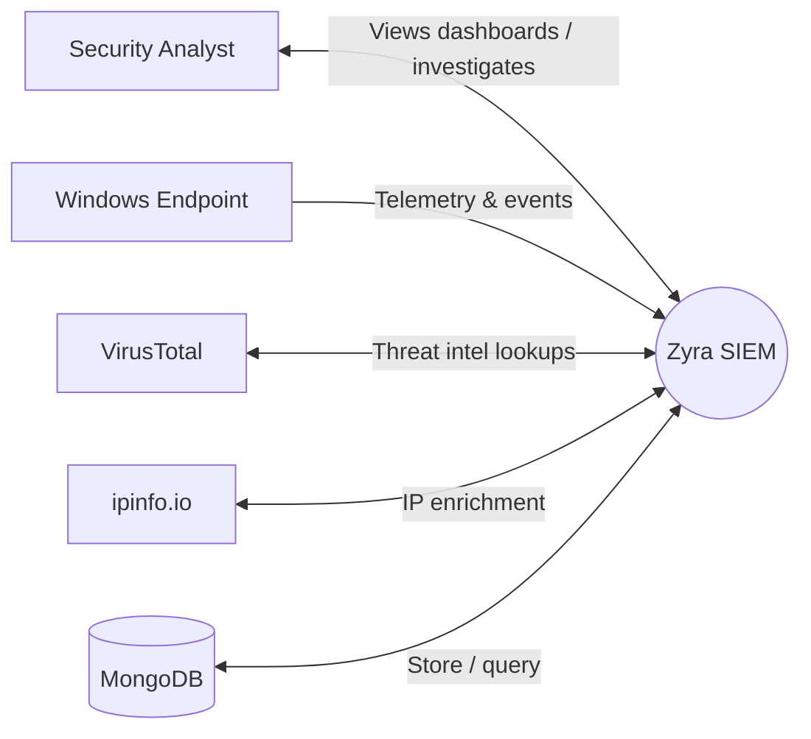

# Zyra SIEM

**Zyra SIEM** is a lightweight, Windows-focused Security Information and Event Management (SIEM) system built around an **agent → API server → web dashboard** architecture.

It collects endpoint telemetry (system metrics, Windows Event Logs, network/DNS signals, process activity, registry changes), performs basic anomaly detection, stores events centrally in MongoDB (with **SQLite offline fallback**), and serves a real-time dashboard via REST + WebSockets.


## Table of contents

- [Key features](#key-features)
- [High-level architecture](#high-level-architecture)
- [Data Flow Diagrams (DFD) - Level 0 to Level 3](#data-flow-diagrams-dfd---level-0-to-level-3)
- [Data model](#data-model)
- [API reference](#api-reference)
- [Installation](#installation)
- [Configuration](#configuration)
- [Running Zyra SIEM](#running-zyra-siem)
- [Project structure](#project-structure)
- [Security notes](#security-notes)
- [Troubleshooting](#troubleshooting)
- [Contributing](#contributing)
- [License](#license)

## Key features

- **Windows endpoint telemetry**: CPU/RAM/Disk, processes, DNS queries, basic network in/out signals, registry change monitoring, System + Security Event Logs.
- **Anomaly detection (agent-side)**:
  - High CPU \(> 90%\)
  - Multiple failed logins \(> 5 per user\)
  - Unusual login times \(\(00:00\)–\(06:00\)\)
  - File deletion signals (Event ID 4663)
  - Suspicious processes (high CPU or `cmd.exe` heuristic)
  - “Unknown country” outbound IP heuristic (via ipinfo)
- **Threat intel enrichment**:
  - **VirusTotal** hash lookups (optional) for running executables
  - **ipinfo.io** enrichment for public IP locations (optional)
- **Central storage**: MongoDB collections `device_info`, `logs`, `alerts`.
- **Offline mode**: agent writes to `local_storage.db` (SQLite) when MongoDB is unreachable and syncs later.
- **Dashboard**: FastAPI + Jinja templates with **live updates** via `ws://.../ws/dashboard`.

## High-level architecture

Default ports:
- **API server**: `server.py` on `http://localhost:5000`
- **Dashboard web app**: `app.py` on `http://localhost:5001`

```
┌────────────────────────────┐
│   Web Dashboard (FastAPI)  │  app.py  :5001
│   HTML via Jinja templates │
└───────────────┬────────────┘
                │ REST + WebSocket
┌───────────────▼────────────┐
│        API Server           │  server.py :5000
│ REST: /api/v1/*             │
│ WS:   /ws/dashboard         │
└───────────────┬────────────┘
                │ MongoDB reads/writes
┌───────────────▼────────────┐
│          MongoDB            │  zyra_siem
│ device_info / logs / alerts │
└───────────────▲────────────┘
                │
┌───────────────┴────────────┐
│     Windows Agent           │  agent.py (Admin)
│ Telemetry + detection       │
└────────────────────────────┘
```

## Data Flow Diagrams (DFD) - Level 0 to Level 3

These DFDs are intentionally **data-centric**: they focus on what data moves where, and what processes/stores are involved.

### DFD Level 0 (Context)



### DFD Level 1 (System decomposition)

```mermaid
flowchart LR
  subgraph External
    Analyst[Security Analyst]
    Endpoint[Windows Endpoint]
    VT[VirusTotal]
    IPInfo[ipinfo.io]
  end

  subgraph ZyraSIEM[Zyra SIEM]
    P1[1. Endpoint Agent\n(agent.py)]
    P2[2. API Server\n(server.py)]
    P3[3. Dashboard Web App\n(app.py)]
    D1[(MongoDB\nzyra_siem)]
    D2[(SQLite Offline Store\nlocal_storage.db)]
  end

  Endpoint -->|metrics / logs / network / processes| P1
  P1 -->|device_info upsert| D1
  P1 -->|logs documents| D1
  P1 -->|alerts documents| D1
  P1 -->|offline logs/alerts| D2
  D2 -->|sync when online| D1

  P1 <-->|VT hash lookups (optional)| VT
  P1 <-->|IP enrichment (optional)| IPInfo

  P2 -->|query logs/alerts/devices| D1
  P3 -->|REST calls /api/v1/*| P2
  P3 <-->|WS /ws/dashboard| P2
  Analyst <-->|Browser UI| P3
```

### DFD Level 2 (Agent internals)

```mermaid
flowchart TB
  subgraph Agent[Windows Agent (agent.py)]
    A1[Collect system metrics\n(psutil)]
    A2[Read Windows Event Logs\n(System/Security)]
    A3[Capture DNS + traffic hints\n(scapy + Npcap)]
    A4[Process monitoring\n+ optional VT checks]
    A5[Registry monitoring\n(Run key)]
    A6[Anomaly detection\n(rule-based)]
    A7[Persist + sync\n(MongoDB or SQLite)]
  end

  OS[(Windows OS)] --> A1
  OS --> A2
  Net[(Network stack)] --> A3
  OS --> A4
  OS --> A5

  A1 --> Q[(In-memory queues)]
  A2 --> Q
  A3 --> Q
  A4 --> Q
  A5 --> Q

  Q --> A6
  Q --> A7
  A6 -->|alerts| A7

  D1[(MongoDB)] <-->|online writes| A7
  D2[(SQLite local_storage.db)] <-->|offline writes / later sync| A7
  VT[VirusTotal] <-->|optional lookup| A4
  IPInfo[ipinfo.io] <-->|IP enrichment| A3
```

### DFD Level 3 (Alerting & storage pipeline detail)

```mermaid
flowchart LR
  subgraph Pipeline[Agent alerting + storage pipeline]
    S1[1. Gather latest telemetry\nfrom queues]
    S2[2. Normalize into a\nlog_data document]
    S3[3. Detect anomalies\n(rules)]
    S4[4. Persist logs + alerts]
    S5[5. Offline sync worker]
  end

  S1 --> S2
  S2 -->|log_data| S4
  S2 --> S3
  S3 -->|alerts[]| S4

  Mongo[(MongoDB:\nlogs / alerts / device_info)] <-->|insert_one / insert_many| S4
  SQLite[(SQLite:\nlocal_storage.db)] <-->|store_locally| S4
  SQLite -->|read unsent rows| S5
  S5 -->|insert_many + clear| Mongo
```

## Data model

Zyra SIEM stores data in MongoDB database **`zyra_siem`**.

### Collection: `device_info`

- **Purpose**: registers endpoints and tracks last-seen.
- **Key fields (as used by `agent.py`)**:
  - `agent_id` (string, **unique**) — derived from Windows Machine GUID
  - `hostname` (string)
  - `os` (string)
  - `first_seen` (ISO datetime string)
  - `last_updated` (ISO datetime string)

### Collection: `logs`

- **Purpose**: time-series endpoint telemetry snapshots.
- **Shape (as built in `agent.py`)**:
  - `agent_id` (string)
  - `timestamp` (ISO datetime string)
  - `system_metrics` (object): `cpu_percent`, `memory_percent`, `disk_usage`, ...
  - `dns_queries` (array): entries like `{ query, ip, timestamp }`
  - `network` (object): `inbound[]`, `outbound[]` with optional geo fields
  - `system_logs` (array): simplified Windows System log entries
  - `security_logs` (array): simplified Windows Security log entries
  - `processes` (array): `{pid, name, username, cpu_percent, memory_percent, exe_path, timestamp}`
  - `registry_changes` (array): recent changes snapshot

### Collection: `alerts`

- **Purpose**: anomaly/threat detections produced by the agent.
- **Typical fields**:
  - `agent_id` (string)
  - `timestamp` (ISO datetime string)
  - `type` (string) — e.g. `High CPU`, `Multiple Failed Logins`, `Malware Detected`
  - `severity` (string) — e.g. `High`, `Medium`, `Low` (note: case may vary)
  - `details` (string)

## API reference

All API endpoints are served by `server.py` on port **5000**.

### REST endpoints

- **Dashboard summary**
  - `GET /api/v1/dashboard`

- **Logs (table-ready projection)**
  - `GET /api/v1/logs`
  - Query params: `limit`, `offset`, `search`, `sort_by`, `sort_order`, `severity`, `source`

- **Alerts (table-ready projection)**
  - `GET /api/v1/alerts`
  - Query params: `limit`, `offset`, `search`, `sort_by`, `sort_order`, `severity`

- **Agents**
  - `GET /api/v1/agents`
  - Query params: `limit`, `offset`, `sort_by`, `sort_order`

- **Agent details**
  - `GET /api/v1/agent/{agent_id}`

- **Malware (subset of alerts)**
  - `GET /api/v1/malware`

### WebSocket endpoint

- **Live dashboard updates**
  - `WS /ws/dashboard`
  - Sends dashboard data on a ~2 second interval.

### Note on agent-referenced endpoints

`agent.py` references endpoints such as `/get_vt_api_key` and `/command`, but the current `server.py` in this repository does **not** implement them yet. If you plan to use remote command execution or dynamically supply a VirusTotal API key, you’ll need to add those endpoints to `server.py`.

## Installation

### Requirements

- Windows 10/11 (or Windows Server)
- Python 3.8+
- Administrator privileges (agent needs elevated access)
- Npcap (required for Scapy sniffing)
- MongoDB Atlas or a reachable MongoDB instance

### Create a virtual environment (recommended)

```bash
python -m venv venv
venv\Scripts\activate
python -m pip install --upgrade pip
```

### Install dependencies

This repository doesn’t currently ship a `requirements.txt`, so install the runtime dependencies manually:

```bash
pip install pymongo requests psutil dnspython scapy ipinfo pywin32 pillow virustotal-python wget tenacity fastapi uvicorn aiohttp jinja2
```

### Install Npcap (for network capture)

Run:

```bash
python setup.py
```

Or install manually from [`https://npcap.com`](https://npcap.com).

## Configuration

### MongoDB connection

Both `agent.py` and `server.py` currently embed `MONGO_URI`. Update it to match your MongoDB environment.

### External services (optional)

- **VirusTotal**: `agent.py` can perform file hash checks if a VirusTotal key is configured.
- **ipinfo.io**: `agent.py` enriches external IPs using an ipinfo token.

### Recommended environment variables (hardening)

For a safer deployment, migrate secrets from hardcoded values into environment variables (example naming):

- `ZYRA_MONGO_URI`
- `ZYRA_IPINFO_TOKEN`
- `ZYRA_VT_API_KEY`
- `ZYRA_API_SERVER_URL` (agent → server)

## Running Zyra SIEM

Start components in this order:

### 1) Start the API server

```bash
python server.py
```

### 2) Start the dashboard

```bash
python app.py
```

Open `http://localhost:5001`.

### 3) Run the Windows agent (Administrator)

```bash
python agent.py
```

The agent will:
- collect telemetry on a loop
- generate alerts from heuristics
- write to MongoDB when reachable
- fall back to SQLite when offline and sync later

## Project structure

```
ZyraSIEM/
├── agent.py                  # Windows monitoring agent (Admin)
├── server.py                 # FastAPI REST + WebSocket API (port 5000)
├── app.py                    # FastAPI + Jinja dashboard (port 5001)
├── setup.py                  # Npcap installer helper
├── templates/                # Dashboard HTML templates
│   ├── dashboard.html
│   ├── alerts.html
│   ├── logs.html
│   ├── agents.html
│   ├── agent.html
│   └── malware.html
├── local_storage.db          # SQLite fallback store (created at runtime)
├── agent.log                 # Agent logs (created at runtime)
├── server.log                # API server logs (created at runtime)
└── setup.log                 # Setup logs (created at runtime)
```

## Security notes

- **Secrets are currently hardcoded**: MongoDB password, ipinfo token, and (optionally) VirusTotal key behavior should be moved to environment variables or a secrets manager.
- **No auth by default**: the API server enables permissive CORS and exposes endpoints without authentication. For anything beyond local testing, add:
  - authentication/authorization
  - TLS/HTTPS
  - rate limiting
  - request validation and audit logging
- **Run the agent only where authorized**: endpoint monitoring may be regulated by policy/law. Ensure you have permission.

## Troubleshooting

- **Agent won’t start / permission errors**
  - Run `agent.py` as Administrator.

- **No network/DNS telemetry**
  - Install Npcap and ensure Scapy has capture permissions.

- **MongoDB connection failures**
  - Check the connection string, Atlas IP allowlist, and network connectivity.
  - The agent should fall back to `local_storage.db` and sync when connectivity returns.

## Contributing

- Fork the repository
- Create a feature branch
- Make changes with clear commits
- Open a pull request with a test plan

## License

Add a license file (for example, MIT) and update this section accordingly.

