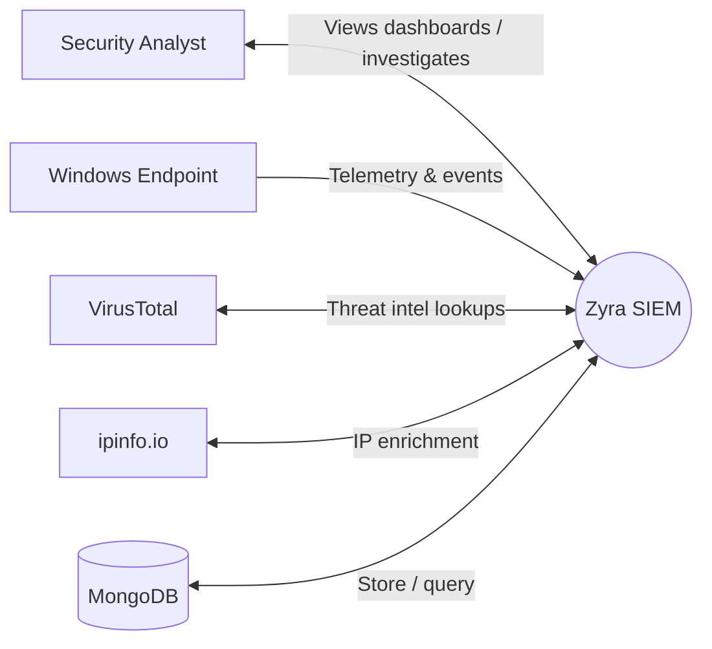
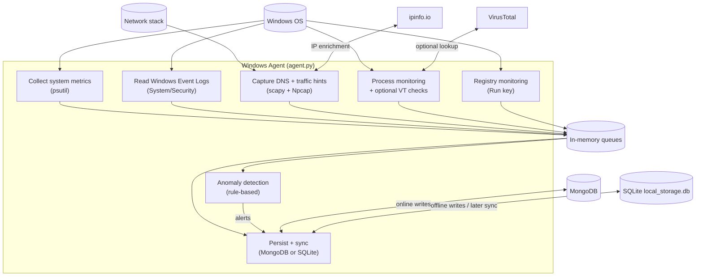
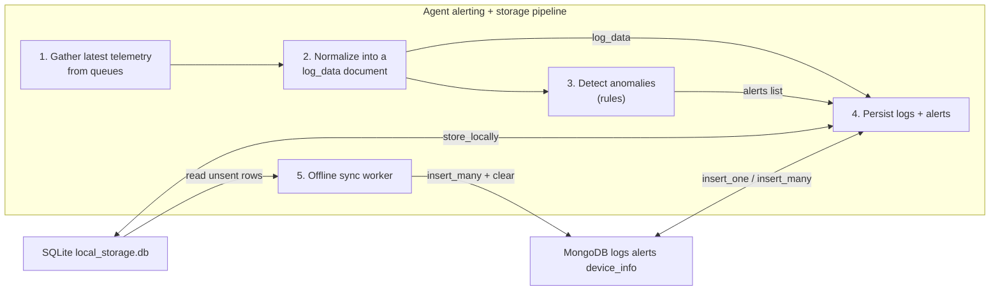

# Zyra SIEM — Data Flow Diagrams (DFD)

This file contains the **4 DFD levels (0–3)** for ZyraSIEM, extracted from `README.md`.

## How to view these diagrams

- **On GitHub/GitLab**: Mermaid code blocks typically render automatically.
- **In Cursor/VS Code**: install a Mermaid preview extension (or use the Markdown preview if Mermaid is supported).

## How to export to image files (PNG/SVG)

If you want **actual diagram files**, you can export Mermaid to images using Mermaid CLI:

```bash
npm i -g @mermaid-js/mermaid-cli
```

Then export (example):

```bash
mmdc -i dfd.md -o dfd.pdf
```

Tip: Mermaid CLI works best when you copy each Mermaid block into its own `.mmd` file (e.g., `dfd-level-0.mmd`) and export one-by-one to `svg` or `png`.

---

## ASCII diagrams (underscore style)

These are the same flows, but drawn with **`_` and `|`** (ASCII boxes) instead of Mermaid.

### ASCII DFD Level 0 (Context)

```
  _______________            ______________________
 |               |          |                      |
 |   ENDPOINT    |--------->|     ZYRA  SIEM       |
 |_______________|          |______________________|
         ^                         ^        ^
         |                         |        |
         |                         |        |
  _______________            ______________  __________________
 |               |          |              ||                  |
 |    ANALYST    |<-------->|    MONGODB   ||  VT / IPINFO     |
 |_______________|          |______________||__________________|
```

### ASCII DFD Level 1 (System decomposition)

```
  _______________                 ________________________________
 |               |               |                                |
 |   ENDPOINT    |-------------->|  (1) AGENT  agent.py (Admin)   |
 |_______________|               |________________________________|
                                        |           |
                                        | logs+     | alerts+
                                        v           v
                               __________________   __________________
                              |                  | |                  |
                              |   MONGODB (D1)    | |   SQLITE (D2)    |
                              |__________________| |__________________|
                                        ^                 |
                                        | sync             | offline store
                                        |                  |
                                        |__________________|

  ___________________           ____________________________           ____________________
 |                   |         |                            |         |                    |
 | (3) DASHBOARD      |<------->| (2) API SERVER server.py   |<------->|  SECURITY ANALYST  |
 | app.py  :5001      |  REST/WS|  :5000  /api/v1 + /ws      |   UI     | (browser)         |
 |___________________|         |____________________________|         |____________________|
```

## DFD Level 0 (Context)



## DFD Level 1 (System decomposition)

```mermaid
flowchart LR
  subgraph External["External"]
    Analyst[Security Analyst]
    Endpoint[Windows Endpoint]
    VT[VirusTotal]
    IPInfo[ipinfo.io]
  end

  subgraph ZyraSIEM["Zyra SIEM"]
    P1["1. Endpoint Agent agent.py"]
    P2["2. API Server server.py"]
    P3["3. Dashboard Web App app.py"]
    D1["MongoDB zyra_siem"]
    D2["SQLite Offline Store local_storage.db"]
  end

  Endpoint -->|metrics / logs / network / processes| P1
  P1 -->|device_info upsert| D1
  P1 -->|logs documents| D1
  P1 -->|alerts documents| D1
  P1 -->|offline logs/alerts| D2
  D2 -->|sync when online| D1

  P1 <-->|VT hash lookups (optional)| VT
  P1 <-->|IP enrichment (optional)| IPInfo

  P2 -->|query logs/alerts/devices| D1
  P3 -->|REST calls /api/v1/*| P2
  P3 <-->|WS /ws/dashboard| P2
  Analyst <-->|Browser UI| P3
```

## DFD Level 2 (Agent internals)



## DFD Level 3 (Alerting & storage pipeline detail)



